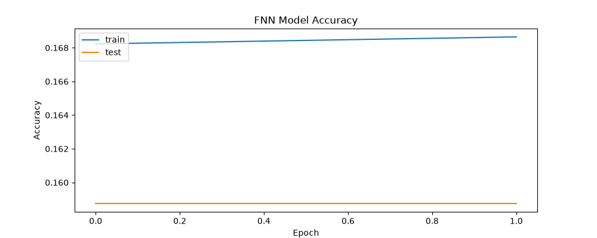
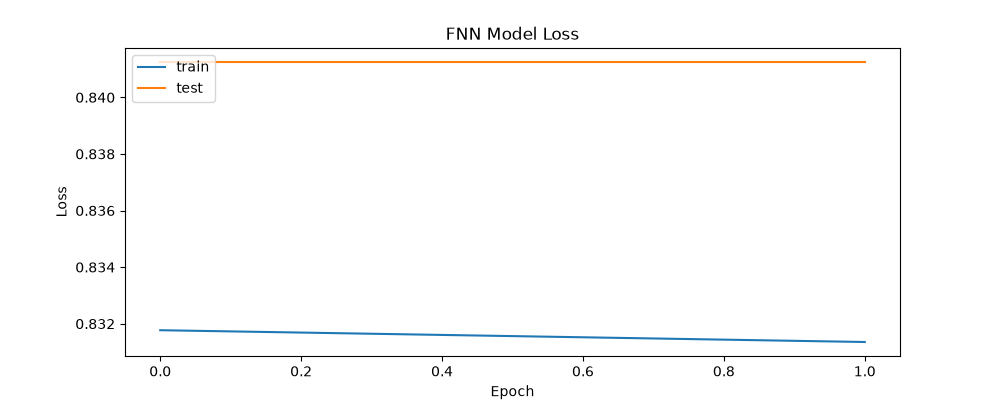
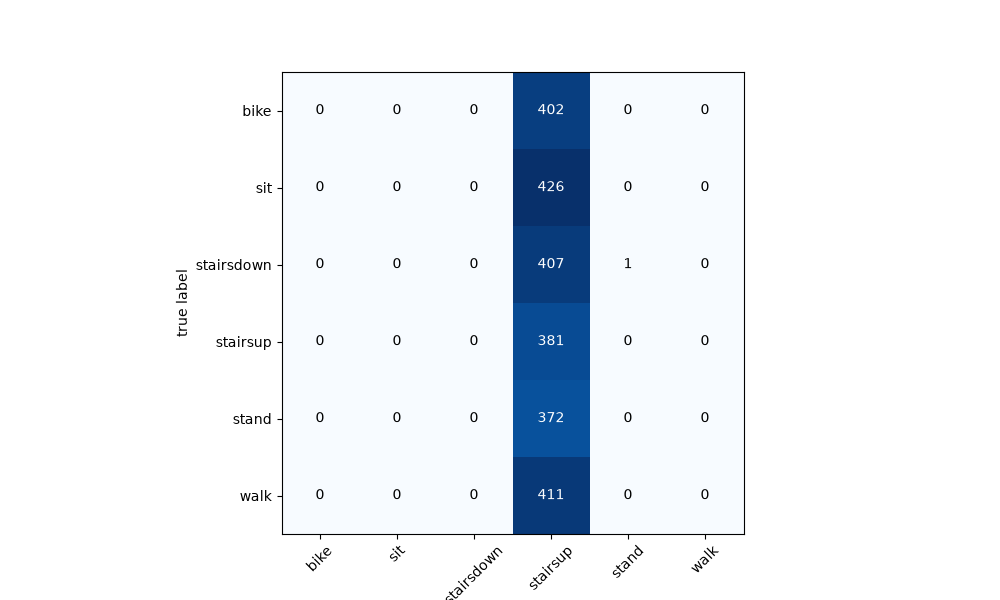
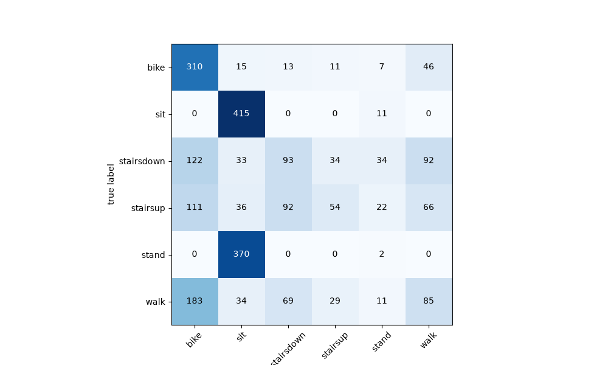

# Human Activity Recognition (HAR) using Deep Learning

Recognize human activities from sensor measurements using Feedforward Neural Network (FNN) and Recurrent Neural Network (RNN) architectures in PyTorch.

## Overview

Human Activity Recognition (HAR) aims to recognize a wide range of activities performed by humans (such as biking, sitting, standing, walking, and climbing stairs) using accelerometer data collected from mobile devices.

This project benchmarks two deep learning architectures on sensor data:
1. **Feedforward Fully Connected Network (FNN)**: A 6-layer dense neural network trained with Cross-Entropy Loss / NLLLoss.
2. **Recurrent Neural Network (RNN)**: A recurrent adaptive framework capturing sequential patterns across sensor dimensions.

### Activities Classified:
* Biking (`bike`)
* Sitting (`sit`)
* Standing (`stand`)
* Walking (`walk`)
* Climbing stairs up (`stairsup`)
* Climbing stairs down (`stairsdown`)

---

## Project Structure

```
HAR/
├── data/                               # Dataset folder
│   └── Phones_accelerometer.csv        # Accelerometer sensor data
├── models/
│   ├── FullyConnectedNetwork.py        # FNN model definition and training loop
│   └── RecursiveNeuralNetwork.py       # RNN model definition and training loop
├── results/                            # Output plots and evaluation metrics
│   ├── accuracy_fnn.png                # Accuracy curve
│   ├── loss_fnn.png                    # Loss curve
│   ├── confusion_matrix_fnn.png        # FNN confusion matrix
│   └── confusion_matrix_rnn.png        # RNN confusion matrix
├── main.py                             # Main training and evaluation script
├── main.ipynb                          # Interactive Jupyter Notebook
├── prepare_data.py                     # Data generation & UCI download utility
├── requirements.txt                    # Project dependencies
└── README.md                           # Documentation
```

---

## Installation & Setup

1. **Clone the repository and navigate into the project directory:**
   ```bash
   cd HAR
   ```

2. **Create and activate a virtual environment:**
   ```bash
   python3 -m venv .venv
   source .venv/bin/activate
   ```

3. **Install dependencies:**
   ```bash
   pip install --upgrade pip
   pip install -r requirements.txt
   ```

---

## Dataset Preparation

The project is built on the **Heterogeneity Human Activity Recognition (HHAR)** dataset from the UCI Machine Learning Repository.

You can prepare the dataset using the included `prepare_data.py` script:

* **Quick Synthetic Test Dataset (Instant):**
  Generates a synthetic dataset matching the HHAR schema with all 6 activities for immediate testing:
  ```bash
  python prepare_data.py --sample --samples-per-class 5000
  ```

* **Official UCI Dataset (~780 MB):**
  Downloads and extracts `Phones_accelerometer.csv` directly from the UCI archive:
  ```bash
  python prepare_data.py --download
  ```

---

## Usage

### 1. Run via CLI Script (`main.py`)

* **Quick verification run (fast):**
  ```bash
  python main.py --sample-size 2000 --fnn-epochs 2 --rnn-epochs 2 --rnn-batch-size 200
  ```

* **Full training run (50 epochs):**
  ```bash
  python main.py
  ```

* **Available Command-Line Options:**
  | Option | Default | Description |
  | :--- | :--- | :--- |
  | `--data-path` | `data/Phones_accelerometer.csv` | Path to dataset CSV |
  | `--sample-size` | `100000` | Number of samples to draw per activity class |
  | `--fnn-epochs` | `50` | Number of epochs for FNN training |
  | `--rnn-epochs` | `50` | Number of epochs for RNN training |
  | `--skip-rnn` | `False` | Skip RNN training |
  | `--skip-fnn` | `False` | Skip FNN training |
  | `--show-plots` | `False` | Display interactive plot windows |

### 2. Run via Jupyter Notebook (`main.ipynb`)

Launch Jupyter Notebook or Jupyter Lab:
```bash
jupyter notebook main.ipynb
```

---

## Model Performance & Results

### Hyperparameters:
* **FNN**: 6 Layers, Batch Size: 100, Learning Rate: 0.001, Epochs: 50
* **RNN**: Neurons: 10, Batch Size: 1000, Learning Rate: 0.01, Epochs: 50

### Evaluation Visualizations:

#### Model Accuracy & Loss (FNN)
<p align="center">
  
  
</p>

#### Confusion Matrices
<p align="center">
  
  
</p>

---

## References

* **HHAR Dataset**: Heterogeneity Activity Recognition Data Set from UCI Machine Learning Repository:
  `https://archive.ics.uci.edu/dataset/344/heterogeneity+activity+recognition`
* Please refer to the research paper `Heterogeneous Human Activity Recognition with Dynamic Sensor Fusion using Deep Learning Models.pdf` included in this repository for detailed methodology and sensor fusion analysis.
